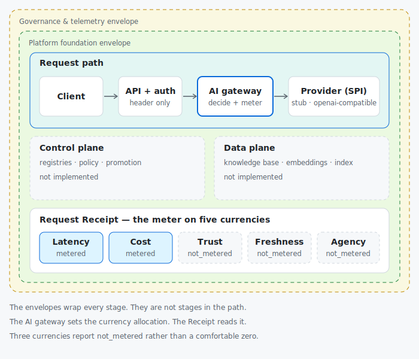
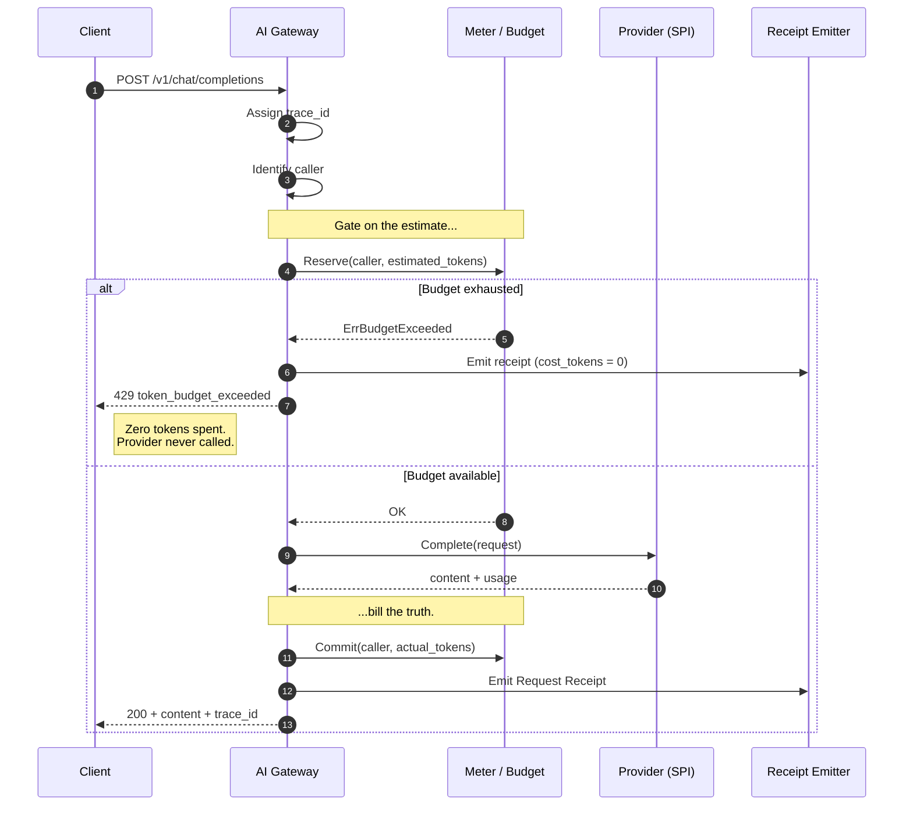
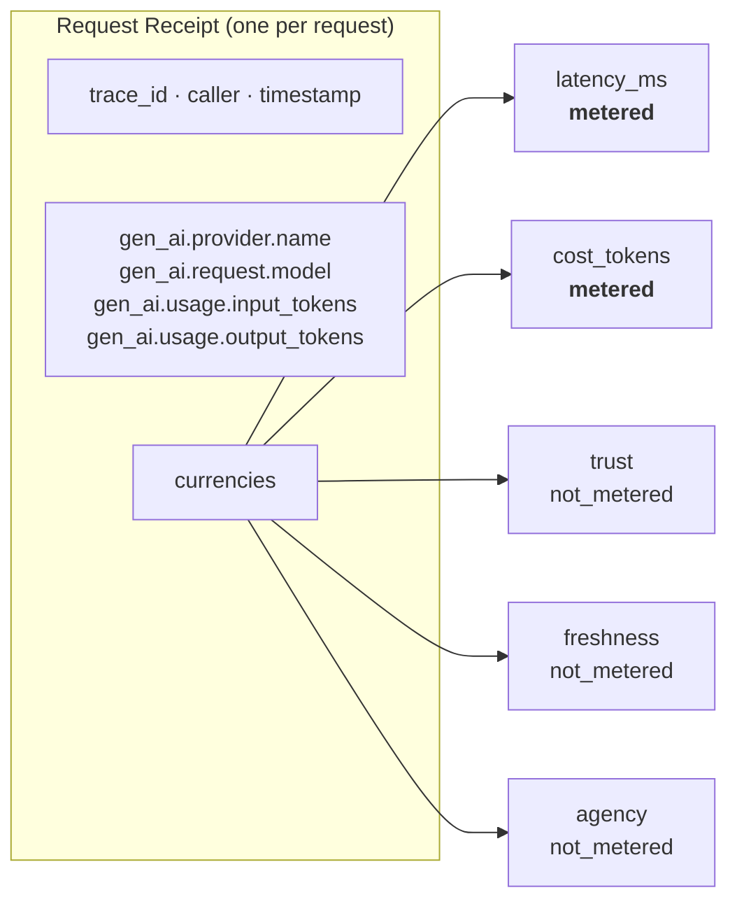

# Diagrams

Diagrams render on GitHub. Source lives beside them so they can be edited rather
than replaced.

---

## 1. The architecture: three planes, two envelopes, five currencies

The two envelopes - platform foundation, and governance and telemetry - wrap
**every** stage of the request path. They are not stages in it. Drawing them as
pipeline steps is how they end up built as afterthoughts.

`control-plane/` and `data-plane/` are drawn dashed because they are named and
empty. They exist in the tree so the model is visible; see
[ADR-0005](../adr/0005-plane-aligned-repository-structure.md).

---

## 2. The request lifecycle

What actually happens on `POST /v1/chat/completions`. Note the ordering: the
budget is **reserved before the provider is called**, so a caller who is out of
budget never spends a token ([ADR-0009](../adr/0009-reserve-then-commit-token-budgeting.md)).

---

## 3. The Request Receipt

Every request returns one. Attribute names follow the OpenTelemetry GenAI
semantic conventions ([ADR-0008](../adr/0008-adopt-opentelemetry-genai-conventions.md))
so the telemetry is portable rather than a private dialect.

Three currencies say `not_metered` rather than reporting a comfortable zero. A
dashboard averaging `trust: 0` would report perfect safety; a dashboard
encountering `not_metered` cannot
([ADR-0011](../adr/0011-honest-instrumentation.md)).

Closing each one is an open issue. That is the roadmap.

---

## Editing these

- The SVG in `docs/assets/architecture.svg` is hand-written and diffable. Edit the
  markup; do not replace it with an exported bitmap.
- Mermaid blocks render natively on GitHub. Keep them in this file rather than
  exporting images, so a reviewer can diff a diagram change.